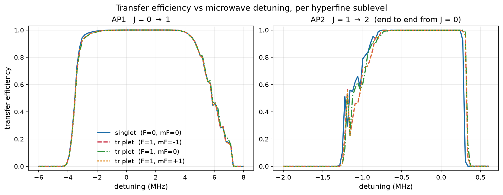
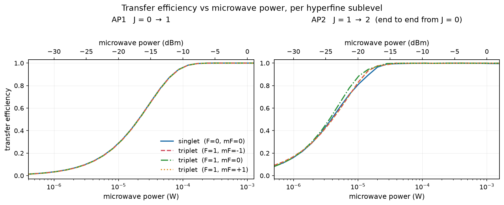
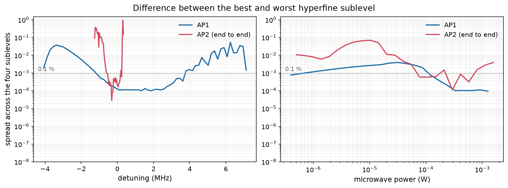
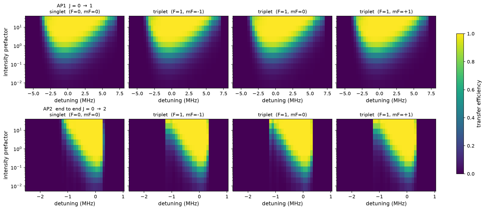

# SPA transfer efficiency does not depend on the hyperfine sublevel

Simulated with `centrex-state-prep`, no stray-microwave background fields.
Companion notebook: [`SPA - singlet vs triplet, no background.ipynb`](./SPA%20-%20singlet%20vs%20triplet,%20no%20background.ipynb).
Figures and every number quoted here are regenerated by
[`scripts/make_singlet_triplet_report_figures.py`](../../../scripts/make_singlet_triplet_report_figures.py),
which writes `figures/report_numbers.json`.

---

## The result

Rotational cooling leaves roughly 2/3 of the ground-state population in J = 0, F = 0 (the
nuclear-spin **singlet**) and 1/3 spread over the three F = 1 sublevels (the **triplet**,
mF = -1, 0, +1). If those transferred through state preparation with different efficiency,
the prepared fraction would depend on the RC outcome. They do not.

At the optimum setpoint, every chain transfers at **≥ 0.9991**, and the largest difference
between the singlet and any triplet sublevel is **1.7e-4**:

| | singlet<br>(F=0, mF=0) | triplet<br>(F=1, mF=-1) | triplet<br>(F=1, mF=0) | triplet<br>(F=1, mF=+1) | spread |
| --- | ---: | ---: | ---: | ---: | ---: |
| AP1  J = 0 → 1 | 0.999983 | 0.999894 | 0.999997 | 0.999894 | 1.0e-04 |
| AP2  conditional | 0.999181 | 0.999421 | 0.999155 | 0.999428 | 2.7e-04 |
| end to end  J = 0 → 2 | 0.999164 | 0.999316 | 0.999152 | 0.999322 | 1.7e-04 |

Applying the nominal RC weights (2/3 : 1/9 : 1/9 : 1/9) gives an end-to-end efficiency of
**0.999197**, against an unweighted mean of **0.999238**. The two agree to `4e-5` — which is
the point: **the answer does not depend on how RC distributes the population.**

The one caveat is a detuning setpoint issue, not a state-preparation-physics issue, and it
is described in [Where the sublevels *do* differ](#where-the-sublevels-do-differ).

---

## What was simulated

Two microwave-driven adiabatic passages in series, both present in the same propagation:

- **AP1** (repo name `SPA1`), J = 0 → 1 at 13.340050145 GHz, beam centre at z = 0.000 cm
- **AP2** (repo name `SPA2`), J = 1 → 2 at 26.668808191 GHz, beam centre at z = 2.857 cm

The passage is **spatial, not chirped**: each microwave sits at a fixed carrier while the
DC Stark shift sweeps the effective detuning through resonance as the molecule flies
through the beam at 184 m/s.

Four chains are propagated simultaneously, one per J = 0 hyperfine sublevel. Each keeps its
nuclear-spin state the whole way, and the reported number is the population of **that one
specific target state** — not a sum over a manifold.

### How the four chains are actually defined

This needs care, because **F₁ and F are not good quantum numbers for the targets.** The
states are constructed in the *decoupled* basis as `mJ = 0` times a definite nuclear-spin
state, and only for J = 0 does that happen to coincide with a single `|F₁, F, mF⟩`:

| chain | nuclear spin part | mJ | mF |
| --- | --- | ---: | ---: |
| singlet | (\|↑↓⟩ − \|↓↑⟩)/√2 | 0 | 0 |
| triplet_m | \|↓↓⟩ | 0 | -1 |
| triplet_0 | (\|↑↓⟩ + \|↓↑⟩)/√2 | 0 | 0 |
| triplet_p | \|↑↑⟩ | 0 | +1 |

`mJ` and the nuclear-spin state are the same at every rung; `mF = mJ + m₁ + m₂` is exactly
conserved. The coupled labels, by contrast, are only *dominant components*, and they get
worse up the ladder:

| | singlet | triplet_m | triplet_0 | triplet_p |
| --- | --- | --- | --- | --- |
| J = 0 | F=0, mF=0 (100 %) | F=1, mF=-1 (100 %) | F=1, mF=0 (100 %) | F=1, mF=+1 (100 %) |
| J = 1 | F=1, mF=0 (67 %) | F=2, mF=-1 (50 %) | F=2, mF=0 (67 %) | F=2, mF=+1 (50 %) |
| J = 2 | F=2, mF=0 (60 %) | F=3, mF=-1 (40 %) | F=3, mF=0 (60 %) | F=3, mF=+1 (40 %) |

So writing the singlet chain as "F = 0 → F = 1 → F = 2" is shorthand for the largest term
of a superposition, not a statement that F is conserved or even defined. What *is* exact
throughout is `mF` and the nuclear-spin character.

Conditions: pure z (π) microwave polarization, k along x, 1 inch FWHM Gaussian beams,
measured DC Stark field along z, nominal Bz = 1e-3 kept non-zero so the mF sublevels are
non-degenerate and adiabatic labelling is well defined, rotational manifolds J = 0…3
(J = 0 and 3 are required because the DC field couples to them), 10 000 timesteps.
No `background_field=True` microwave appears anywhere.

10 000 timesteps is enough, and this has been measured rather than assumed: against a
ladder out to 160 000 steps the transfers sit within `~1.0e-5` (AP2) and `~9.2e-5` (AP1)
of the converged values, and the singlet-vs-triplet **spread** — the quantity this report
is actually about — within `~1.0e-5`, roughly 6 % of the `1.7e-4` being reported. The
shipped defaults are also the right ones here: a graded time grid cannot pay (its ceiling
on this field profile is `1.58x`, below the error cancellation a uniform grid enjoys), and
the Magnus propagator, while `1.35x` faster per run, needs about `23x` more wall clock to
reach the same accuracy. See "Performance Priority E" in `IMPROVEMENTS.md`.

Propagating the four chains together is exactly equivalent to running them one at a time:
the simulator carries initial states as a block with no coupling between rows. The notebook
verifies this numerically — running the singlet alone reproduces its row from the
four-state run to `1.8e-15` — which is what makes the post-hoc RC weighting above exact.

---

## Frequency scans



Both passages show the flat-topped response characteristic of adiabatic transfer, and
**the four curves are indistinguishable across the entire plateau**. They separate only on
the edges, where the passage stops being adiabatic.

AP1 is broad — 9.1 MHz wide at half maximum, with all four sublevels above 0.999 from
-0.75 to +3.10 MHz. AP2 is far narrower at 1.3 MHz FWHM, with a notably **asymmetric**
shape: a soft left edge and a hard cliff on the positive side. The asymmetry is expected,
since the Stark sweep only crosses resonance for one sign of detuning.

## Power scans



Saturation curves, again with the four sublevels lying on top of each other. Once the drive
is strong enough for the passage to be adiabatic, the efficiency saturates and stays there
over more than a decade of power.

| | optimum power | all four > 0.998 | Rabi rate at optimum |
| --- | ---: | --- | ---: |
| AP1 | 6.46e-04 W  (-1.90 dBm) | 2.36e-04 to 1.26e-03 W  (-6.3 to +1.0 dBm) | 158.6 kHz |
| AP2 | 4.13e-04 W  (-3.84 dBm) | 7.70e-05 to 8.08e-04 W  (-11.1 to -0.9 dBm) | 113.3 kHz |

The **Rabi rate is the transferable number**; the powers in Watts apply to the modelled
optics (1 inch FWHM Gaussian, pure z polarization) and would change with the real beam
geometry.

## The spread, quantitatively



This is the claim in its sharpest form: the difference between the best and worst sublevel.
On the plateau it sits at roughly **1e-4**, i.e. 0.01 %, and it rises by four orders of
magnitude only at the edges of the passage window.

## Two-dimensional maps



Detuning against power, one panel per sublevel. That the four panels in each row are
visually identical is itself the result.

---

## Where the sublevels *do* differ

Honest reporting requires the counter-example, and it matters operationally.

At the **hard positive-detuning cliff of AP2**, at +307.5 kHz, the four sublevels come apart
completely:

| detuning | singlet | triplet_m | triplet_0 | triplet_p |
| ---: | ---: | ---: | ---: | ---: |
| +242.5 kHz | 0.9985 | 0.9985 | 0.9992 | 0.9985 |
| +275.0 kHz | 0.9249 | 0.9928 | 0.9988 | 0.9928 |
| **+307.5 kHz** | **0.0368** | **0.9602** | **0.9847** | **0.9602** |
| +340.0 kHz | 0.0010 | 0.0713 | 0.1600 | 0.0714 |

The singlet falls off the cliff **before** the triplets, because its transition frequency is
37.6 kHz lower (see the theory section). Where the cliff is nearly vertical, a 37.6 kHz
offset becomes a 0.95 difference in efficiency.

This is *not* a contradiction of the result above — it is the same physics. It says the
sublevels are equivalent **provided the setpoint is on the plateau**, and it sets a
detuning-stability requirement.

**Practical consequence.** The maximin optimum reported by the notebook's coarse 2D grid,
+212 kHz, sits only about 80 kHz from the cliff. The finer scan here shows the plateau where
all four sublevels stay above 0.998 runs from **-505 to +242 kHz**. A setpoint near
**-150 kHz**, the middle of that plateau, keeps roughly 440 kHz of margin to the cliff
instead of 80 kHz, at no cost in efficiency. That is the setpoint to use.

The structure visible on AP2's soft left edge is **physical, not numerical** — partial-
adiabatic interference. Measured over a 10 000 → 160 000 timestep ladder, the AP2
lineshape residual falls `9.2e-6, 3.0e-8, 7.9e-9, 7.8e-9`; the last two are
indistinguishable, so that is arithmetic precision rather than a scheme still
converging. Summing the tail puts the 10 000-step result within `~1.0e-5` of the
converged answer. Reproduce with
`benchmarks/bench_spa_verification.py --phase2 --stages ap2 --lineshape`.

---

## Why the efficiency is state-independent — derivation

### Step 1: what adiabatic passage depends on

Near a crossing, each chain is a two-level problem in the rotating frame,

$$H(t) = \frac{\hbar}{2}\begin{pmatrix} \Delta(t) & \Omega \\ \Omega & -\Delta(t)\end{pmatrix}$$

and the probability of *failing* to transfer is the Landau–Zener result

$$P_\text{diabatic} = \exp(-2\pi\Gamma), \qquad
\Gamma = \frac{\Omega^{2}}{4\,|d\Delta/dt|}$$

Here the sweep is spatial, not chirped. The carrier is fixed and the DC Stark shift moves
the resonance as the molecule flies through at speed `v`, so with `z = vt`

$$\Delta(z) = \Delta_\text{carrier} - \delta\omega_\text{Stark}(z),
\qquad \left|\frac{d\Delta}{dt}\right| = v\left|\frac{d\delta\omega_\text{Stark}}{dz}\right|_{z_c}$$

evaluated at the crossing point `z_c` where `Δ(z_c) = 0`. Hence

$$\Gamma = \frac{\Omega(z_c)^{2}}{4\,v\,|d\delta\omega_\text{Stark}/dz|_{z_c}}$$

**Everything state-dependent enters through exactly two objects:** the Rabi coupling `Ω`
and the Stark sweep profile `δω_Stark(z)`. If two initial states share both, they transfer
identically — whatever else distinguishes them.

### Step 2: both are matrix elements of one operator, which cannot see nuclear spin

The microwave coupling and the DC Stark shift are matrix elements of the **same** operator,
the molecular electric dipole **d**. The Hilbert space factorises as

$$\mathcal{H} = \mathcal{H}_\text{rot} \otimes \mathcal{H}_{I_1} \otimes \mathcal{H}_{I_2}$$

and **d** acts on the rotational factor alone, so as an operator on the full space it is

$$\hat{O}_q = \hat{d}_q \otimes \mathbb{1}_{I_1} \otimes \mathbb{1}_{I_2}$$

Now write the four chains in the decoupled basis, which is how they are actually built.
Initial states and their matched targets are

$$|\psi_s\rangle = |J,\,m_J = 0\rangle \otimes |\chi_s\rangle, \qquad
|\phi_s\rangle = |J',\,m_J = 0\rangle \otimes |\chi_s\rangle$$

where `s` runs over the four chains and `|χ_s⟩` is one of the four nuclear-spin states.
**The same `|χ_s⟩` appears on both sides** — that is what "matched partner" means. Then

$$\langle\phi_s|\hat{O}_q|\psi_s\rangle
= \langle J', 0|\hat{d}_q|J, 0\rangle \cdot \langle\chi_s|\chi_s\rangle
= \langle J', 0|\hat{d}_q|J, 0\rangle$$

which carries **no label `s`**. The identity operator on the spin factors returns the norm
of `|χ_s⟩`, which is 1 for every chain, and nothing else about the nuclear spin survives.

The identical argument applies to the Stark shift, taking `q = 0` and `J' = J`, so
`δω_Stark(z)` is common to all four as well. Therefore `Ω` is common, `dΔ/dt` is common,
`Γ` is common, and the transfer efficiency is common. **∎**

For the record, the surviving rotational element follows from Wigner–Eckart on
`H_rot` alone; for the J = 0 → 1, `mJ = 0 → 0`, `q = 0` case it is `1/√3`.

### Step 3: reconciling this with F₁, F and mF, which *are* all different

Step 2 is a one-line calculation in the decoupled basis. In the coupled basis the same
quantity looks like a miracle, and the natural objection is: if the four chains carry
different F and different mF, how can they possibly share a matrix element? In the coupled
basis they visibly do not share one — Wigner–Eckart gives each transition its own factors,

$$\langle (J'I_1)F_1'I_2; F'm_F'|\,\hat{d}_q\,|(JI_1)F_1I_2; Fm_F\rangle
= (-1)^{F'-m_F'}\begin{pmatrix}F' & 1 & F\\ -m_F' & q & m_F\end{pmatrix}
\langle\cdots F'\|d\|\cdots F\rangle$$

and because **d** touches only the rotational factor, the reduced element peels the two
spins off one at a time, leaving two 6j symbols:

$$\langle (J'I_1)F_1'I_2;F'\|d\|(JI_1)F_1I_2;F\rangle
\;\propto\; \begin{Bmatrix}F_1' & F' & I_2\\ F & F_1 & 1\end{Bmatrix}
\begin{Bmatrix}J' & F_1' & I_1\\ F_1 & J & 1\end{Bmatrix}
\langle J'\|d\|J\rangle$$

Those 3j and 6j factors genuinely differ between `F = 0 → 1` and `F = 1 → 2`. Three things
resolve the apparent conflict:

1. **F₁ never distinguishes the chains.** For these states F₁ = J + ½ throughout — ½, 3⁄2,
   5⁄2 at J = 0, 1, 2 — identical across all four chains at every rung. It varies *down*
   the ladder, not *across* the sublevels.
2. **F and mF are composite labels**, `F = J + I₁ + I₂` and `mF = mJ + m₁ + m₂`. All four
   states share the same `J` and the same `mJ = 0`, so every difference in F and mF is
   inherited entirely from the nuclear-spin part. "Different F, mF" and "different nuclear
   spin" are not two facts; they are one fact in two bases.
3. **F is not conserved and is barely even defined here.** As the table earlier shows, the
   targets are 40–60 % superpositions in F. The physical states are superpositions whose
   amplitudes *are* the recoupling coefficients, so the sum over coupled components must
   collapse back to the single decoupled number of Step 2.

Point 3 is the crux, so here it is carried out explicitly rather than asserted. Expanding
each AP1 chain over its coupled components and summing amplitude × matrix element:

**singlet** (2 terms) → J = 0 |F=0,mF=0⟩ to J = 1
| ⟨F₁',F',mF'\| d \|F₁,F,mF⟩ | element | amplitudes | contribution |
| --- | ---: | ---: | ---: |
| ⟨½,1,0\|d\|½,0,0⟩ | -0.333333 | -0.5774 | +0.192450 |
| ⟨3⁄2,1,0\|d\|½,0,0⟩ | +0.471405 | +0.8165 | +0.384900 |
| | | **total** | **+0.577350** |

**triplet_0** (2 terms) → J = 0 |F=1,mF=0⟩ to J = 1
| ⟨F₁',F',mF'\| d \|F₁,F,mF⟩ | element | amplitudes | contribution |
| --- | ---: | ---: | ---: |
| ⟨½,0,0\|d\|½,1,0⟩ | -0.333333 | -0.5774 | +0.192450 |
| ⟨3⁄2,2,0\|d\|½,1,0⟩ | +0.471405 | +0.8165 | +0.384900 |
| | | **total** | **+0.577350** |

**triplet_p** (3 terms) → J = 0 |F=1,mF=+1⟩ to J = 1
| ⟨F₁',F',mF'\| d \|F₁,F,mF⟩ | element | amplitudes | contribution |
| --- | ---: | ---: | ---: |
| ⟨½,1,1\|d\|½,1,1⟩ | -0.333333 | -0.5774 | +0.192450 |
| ⟨3⁄2,1,1\|d\|½,1,1⟩ | -0.235702 | -0.4082 | +0.096225 |
| ⟨3⁄2,2,1\|d\|½,1,1⟩ | +0.408248 | +0.7071 | +0.288675 |
| | | **total** | **+0.577350** |

(`triplet_m` is the mirror of `triplet_p`, also 3 terms, also +0.577350.)

Different **numbers of terms**, different **magnitudes**, different **signs** — and every
total is `+0.577350 = 1/√3`, exactly the bare rotational element of Step 2. The coupled
basis scatters the answer across F components and the recoupling coefficients gather it
back. This is a theorem, not a coincidence, and it is why the equality is invisible in the
F basis and trivial in the decoupled one.

The consequence, measured on the full states: the four chains' angular matrix elements are
equal to every digit computed, a relative spread of exactly `0.0`:

| | singlet | triplet_m | triplet_0 | triplet_p |
| --- | ---: | ---: | ---: | ---: |
| AP1 Ω/2π at 5e-5 W | 44110.058 Hz | 44110.058 Hz | 44110.058 Hz | 44110.058 Hz |
| AP2 Ω/2π at 5e-5 W | 39453.235 Hz | 39453.235 Hz | 39453.235 Hz | 39453.235 Hz |

### Step 4: why the agreement is not perfect

Step 2 assumed the states are exact products `|J, mJ⟩ ⊗ |χ_s⟩`. The true eigenstates are
not: the hyperfine terms — nuclear spin–rotation `c₁ I₁·J`, `c₂ I₂·J`, and the spin–spin
terms — do not commute with that factorisation. They mix in other states with amplitude

$$\varepsilon \sim \frac{H_\text{hf}}{\Delta E_\text{Stark}}$$

so the product form, and with it the exactness of Step 2, holds only to order `ε`. At the
beam centres:

| | Stark shift | hyperfine spread | ratio |
| --- | ---: | ---: | ---: |
| AP1 centre (172.4 V/cm) | 3.365 MHz | 212.7 kHz (J = 1) | 15.8 |
| AP2 centre (109.2 V/cm) | 1.351 MHz | 358.5 kHz (J = 2) | 3.8 |

So decoupling is good but not complete, especially for AP2. The residual mixing shows up as
a small difference in **transition frequency** between the four chains:

| | frequency spread across the four chains | feature FWHM | ratio |
| --- | ---: | ---: | ---: |
| AP1 | 2.8 kHz | 9.1 MHz | 3.0e-4 |
| AP2 | 37.6 kHz | 1.3 MHz | 2.9e-2 |

### Step 5: why the residual does not matter — and exactly where it does

The residual is a shift `δ` in each chain's resonance position. Its effect on the measured
efficiency is `δ · dP/dΔ`, so everything depends on the local slope of the response.

On the plateau that slope is essentially zero, for a structural reason:
**Landau–Zener saturates.** With `P = 1 − exp(−2πΓ)`,

$$\frac{dP}{d\Delta} = 2\pi\,e^{-2\pi\Gamma}\,\frac{d\Gamma}{d\Delta}$$

which is suppressed by `exp(−2πΓ)`. Once `Γ ≫ 1` the response is exponentially flat, and
sitting at slightly different points on a flat top costs nothing. This is the real reason
the four curves lie on top of each other, and it is stronger than the observation that
`δ` is small.

The same expression says exactly where the argument must fail: **wherever the response is
steep rather than flat**, i.e. at the edges, where `Γ ≲ 1`. And the ratio table predicts
*which* passage fails first — AP2's relative differential is 95× AP1's. That is what the
data shows: AP1 never resolves a sublevel difference beyond 5.4e-2, at the very foot of its
response, while AP2 reaches 0.95 at its cliff.

#### The quantitative test

This is falsifiable, so it is worth testing rather than asserting. If the residual really
is nothing but a resonance-position offset, then **each chain's cutoff must sit at a
carrier detuning displaced by exactly its transition-frequency offset** — a number computed
from the Hamiltonian, predicting a feature of the time-dependent dynamics.

Scanning the AP2 cutoff at 2.5 kHz resolution and taking each chain's 50 % crossing:

| chain | predicted shift | measured shift | difference |
| --- | ---: | ---: | ---: |
| singlet | -37.58 kHz | -38.30 kHz | -0.72 kHz |
| triplet_m | -7.08 kHz | -4.15 kHz | +2.94 kHz |
| triplet_0 | 0 (reference) | 0 | 0 |
| triplet_p | -7.08 kHz | -4.15 kHz | +2.94 kHz |

The dominant effect — the singlet's 37.6 kHz offset — is reproduced to **0.72 kHz, about
2 %**. The triplet shifts are small enough that the discrepancy is about one scan step. The
mechanism is confirmed: the entire residual state dependence is a resonance-position
offset, invisible wherever the response is flat and fully visible where it is steep.

### Step 6: a symmetry check

`triplet_m` and `triplet_p` agree to six digits everywhere. This is required: with B along z
and π polarization, the Hamiltonian is symmetric under mF → -mF. The symmetry is not quite
exact — the Zeeman term splits them — but only by **4.4 mHz** (AP1) and **1.6 Hz** (AP2)
in transition frequency, which is utterly negligible against the MHz-scale features. Their
agreement in the data is a useful check that the simulation is behaving.

---

## Caveats

- **Single forward velocity** (184 m/s). No velocity averaging; slower or faster molecules
  see a different sweep rate and therefore a different `Γ`. The conclusion is robust
  because it rests on all four sublevels sharing whatever `Γ` applies, but the absolute
  efficiencies would shift.
- **No stray microwave background.** Adding SPA or RC background fields changes the
  picture; that is covered by the other notebooks in this directory and by
  `scripts/analyze_spa2_bg_feature.py`.
- **Reported numbers are identified by quantum numbers at readout**, via
  `select_eigenstate` against identities measured by a microwaves-off reference run —
  not by an index carried from t = 0. That matters because a carried index is an
  *adiabatic* label, and it is only safe to compare across step counts while the tracker
  resolves every crossing; the notebook records the J = 2 singlet moving 32 → 29 at
  80 000 steps. The two readings agree to `0.000e+00` at the 10 000 steps used here, and
  the identities themselves were checked stable over 2 500–40 000 steps and both time
  samplings. (`scripts/make_singlet_triplet_report_figures.py` still reads by tracked
  index and has not been updated.)
- **The J = 2 target identification is loose**, and this is the weakest link in the
  labelling. The nominal decoupled state overlaps its tracked eigenstate by only 0.61–0.72
  at t = 0, with 28–36 % sitting on a *second* J = 2 eigenstate of the same mF (the J = 1
  targets are much cleaner at 0.98, and J = 0 is essentially exact). The maximum is still
  unambiguous — a factor 1.7–2.6 above the runner-up, rising to 2.4–3.6 at the AP2 beam
  centre where the transfer actually happens — and mF comes out exactly integer for every
  tracked state. So "the J = 2 partner" means *the adiabatic state that at t = 0 most
  resembles the decoupled target*, which is well defined but is not the same as saying the
  molecules land in a pure `|F = 3, mF⟩` state. This affects what the final state should be
  called; it does not affect the comparison between sublevels, since all four chains are
  identified the same way and carry comparable overlaps.
- **Population reaching the right J but the wrong hyperfine substate** is counted as loss,
  not success. At the optima it is `1.0e-4` (AP1) and `5.5e-4` (AP2).
- **Quoted optima are grid arg-maxima**, and the plateaux are broad and flat, so the exact
  coordinates are not meaningful to more than a few significant figures. The operating
  windows are the useful output.

## Reproducing

```powershell
# figures and report_numbers.json (about 2.5 minutes, CPU, 8 workers)
.\.venv\Scripts\python.exe scripts\make_singlet_triplet_report_figures.py

# re-render the figures from cached curves without re-scanning
.\.venv\Scripts\python.exe scripts\make_singlet_triplet_report_figures.py --from-cache

# the full 2D grids behind the heatmaps
uv run jupyter lab "examples/SPA/Experimental verification/SPA - singlet vs triplet, no background.ipynb"
```
